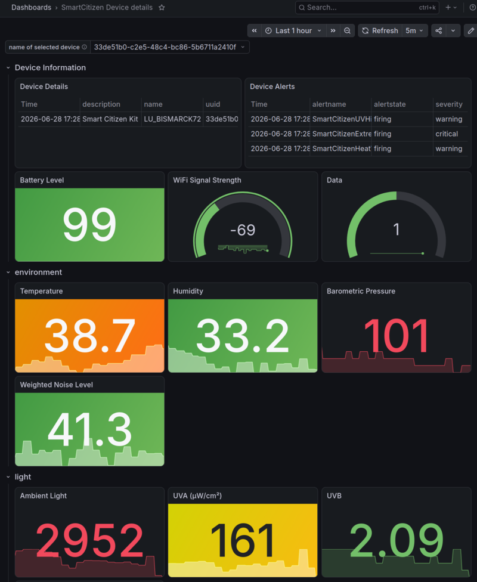

# SmartCitizen Prober

SmartCitizen Prober is a small service for checking the status of
SmartCitizen devices and report their connectivity and sensors' status.

It is split into four binaries based on use case:

1. smcdownloader: Download data from SmartCitizen devices and store it
   locally for further processing.

2. smcjob: Tool that could be scheduled periodically to check device status
   and send notifications if devices are down or not sending data.

3. smcprober: Prometheus exporter to expose device metrics for monitoring.
   It is designed to be deployed in Kubernetes using Helm and could be used
   for advanced monitoring and alerting.

4. gen-device-dashboard: Generates Grafana dashboard JSON from a config file,
   used to keep the dashboard definition in source control.

## Status

Project is in early development stage and developed as sideproject.
Features and APIs may change without notice.

## Features

- Prometheus exporter for SmartCitizen device sensors (temperature, humidity,
  air quality PM1/PM2.5/PM4/PM10, noise, UV, battery, WiFi)
- Prometheus alert rules for environment thresholds (temperature, humidity,
  UV index, noise level, PM2.5/PM10 air quality, Saharan dust detection)
- Sensor health alerts (data absent, stuck sensor detection)
- Grafana dashboard with per-device stat panels and background threshold
  coloring, generated from a JSON config via `gen-device-dashboard`
- Scheduled job (`smcjob`) with ntfy.sh push notifications

## Dashboard



## Getting Started

### Prerequisites

- [Go 1.x](https://golang.org/doc/install) (for local development)
- [Task](https://taskfile.dev) - Task runner (install via
  `brew install go-task/tap/go-task` or see
  [installation guide](https://taskfile.dev/installation/))
- [Docker](https://docs.docker.com/get-docker/) or
  [nerdctl](https://github.com/containerd/nerdctl)
  (for containerized deployment)
- [Helm](https://helm.sh/docs/intro/install/) (for Kubernetes deployment)
- [kubectl](https://kubernetes.io/docs/tasks/tools/)
  (for Kubernetes deployment)

### Installation for Production

This section describes how to deploy `smcprober` in a Kubernetes cluster using Helm
and using pre-defined configuration files and prebuilt Docker images.

#### download configs

As configurations files are not included in the Helm chart package, you need to download them first:

```bash
mkdir tmp && cd tmp
curl -L -O https://raw.githubusercontent.com/timgluz/smcprober/refs/heads/main/configs/config-k8s.json
curl -L -O https://raw.githubusercontent.com/timgluz/smcprober/refs/heads/main/configs/config-exporter-k8s.json
curl -L -o env https://raw.githubusercontent.com/timgluz/smcprober/refs/heads/main/env.example
```

note: as soon as the application matures, configs will be templatized and included in the chart package.

#### update configs and env files

- update `config-k8s.json` and `config-exporter-k8s.json` if needed.

- update `env` file
  only `SMARTCITIZEN_USERNAME` & `SMARTCITIZEN_TOKEN` are required.
  The value of `SMARTCITIZEN_USERNAME` would be your email and
  `SMARTCITIZEN_TOKEN` is your API key that you access on your Smartcitizen's profile.

NTFY Webhooks urls are optional, they are used only for sending alerts.

#### installation

- deploy helm chart

```bash
helm install smcprober-smoke oci://registry-1.docker.io/tauho/smcprober \
  --namespace smcprober-smoke \
  --create-namespace \
  --set namespace=smcprober-smoke \
  --set-file=configJSON=config-k8s.json \
  --set-file=configExporterJSON=config-exporter-k8s.json \
  --set-file=secret.env=env
```

- list all resources in namespace

```bash
kubectl get all -n smcprober-smoke
```

### uninstall

```bash
helm uninstall smcprober-smoke
```

### Installation for Development

1. Clone the repository:

```bash
git clone <repository-url>
cd smcprober
```

1. Install Go dependencies:

```bash
go mod download
```

### Configuration

1. Update environment variables in `.env` file:

```bash
cp .env.example .env
nano .env
```

1. Configure the application settings in `configs/config.json`:

### Running the Application

#### Run Locally

```bash
task run:exporter   # Prometheus exporter on port 8080
task run:job        # One-shot alert job
task run:downloader # Download device data from API
```

#### Run with Docker

```bash
task build:docker   # Build image via nerdctl
task run:docker     # Build and run container
```

### Development

Available Task commands:

- `task run:exporter` - Run Prometheus exporter locally (port 8080)
- `task run:job` - Run one-shot alert job
- `task run:downloader` - Download device data from API
- `task build:docker` - Build Docker image via nerdctl
- `task run:docker` - Build and run Docker container
- `task lint:go` - Run golangci-lint
- `task lint:go:fix` - Run golangci-lint with auto-fix
- `task lint:all` - Run all linters (Go, Helm, Markdown)
- `task test:alerts` - Run Prometheus alert rule tests
- `task generate:dashboards` - Regenerate Grafana dashboard JSON
- `task template:helm` - Template and validate Helm chart
- `task release:docker` - Release Docker image to registry
- `task release:helm` - Package and push Helm chart
- `task release` - Release both Docker and Helm
- `task deploy:credentials` - Deploy credentials to Kubernetes
- `task deploy:ci:credentials` - Deploy Docker credentials for CI pipeline (smc-cicd namespace)

View all available tasks:

```bash
task --list
```

#### Alert rule tests

Alert rules in `helm/alerts/` are tested with `promtool`.
[mise](https://mise.jdx.dev) manages the pinned `promtool` version:

```bash
mise install   # one-time setup
task test:alerts
```

#### Grafana dashboard

The dashboard JSON committed to `helm/dashboards/` is generated from
`configs/device-dashboard.json`. After editing the config, regenerate:

```bash
task generate:dashboards
```

### Deployment

#### Kubernetes with Helm

1. Create the namespace:

```bash
kubectl create namespace smcprober
```

1. Deploy credentials (requires `DOCKER_USERNAME` and `DOCKER_PASSWORD`
   environment variables):

```bash
DOCKER_USERNAME=your-username DOCKER_PASSWORD=your-password task deploy:credentials
```

Note: The `deploy:credentials` task also creates the namespace if it
doesn't exist.

1. Template and preview the Helm deployment:

```bash
task template:helm
```

1. Deploy generated Helm chart to cluster:

```bash
k apply -f smcprober.yaml
```

#### Prometheus Monitoring

The Helm chart includes optional ServiceMonitor support for automatic metrics
discovery by Prometheus Operator.

**Prerequisites:**

- [Prometheus Operator](https://github.com/prometheus-operator/prometheus-operator)
  installed in your cluster

**Enable ServiceMonitor:**

```bash
helm install smcprober ./helm \
  --set "imagePullSecrets[0].name"="smcprober-registry" \
  --set-file=config=configs/config-k8s.json \
  --set-file=secret.env=.env \
  --set serviceMonitor.enabled=true
```

**Configure ServiceMonitor:**

You can customize the ServiceMonitor settings in your `values.yaml`:

```yaml
serviceMonitor:
  enabled: true
  interval: 30s # Scrape interval
  scrapeTimeout: 10s # Scrape timeout
  path: /metrics # Metrics endpoint path
  honorLabels: true # Honor labels from scraped metrics
  labels: {} # Additional labels for ServiceMonitor
  annotations: {} # Additional annotations
```

The application exposes Prometheus metrics at `/metrics` endpoint on port 8080.

## CI/CD

Multi-arch Docker images are built via a Tekton pipeline defined in
`helm/pipelines/build-multiarch-image.yaml`. It runs a credential pre-check
first, then parallel `linux/amd64` and `linux/arm64` builds, and finally
merges them into a single manifest.

Pipeline task order:

```
verify-creds
    ├── build-amd64 (parallel)
    └── build-arm64 (parallel)
            └── create-manifest
```

### Prerequisites

- [Tekton Pipelines](https://tekton.dev/docs/installation/pipelines/) installed in your cluster
- [tkn CLI](https://tekton.dev/docs/cli/) installed locally
- The `verify-dockerhub-creds`, `git-clone-and-build`, and `create-docker-manifest` Tasks deployed to the `smc-cicd` namespace
- A Kubernetes Secret named `docker-config` containing Docker Hub credentials in the `smc-cicd` namespace

### Deploy the pipeline

```bash
kubectl create namespace smc-cicd --dry-run=client -o yaml | kubectl apply -f -
kubectl apply -f helm/tasks/verify-dockerhub-creds.yaml
kubectl apply -f helm/tasks/git-clone-and-build.yaml
kubectl apply -f helm/tasks/create-docker-manifest.yaml
kubectl apply -f helm/pipelines/build-multiarch-image.yaml
```

Create the Docker Hub credentials secret (requires `DOCKER_USERNAME` and `DOCKER_PASSWORD` in `.env`):

```bash
task deploy:ci:credentials
```

Verify registration:

```bash
tkn pipeline list -n smc-cicd
```

### Trigger a build

```bash
tkn pipeline start build-multiarch-image \
  --namespace smc-cicd \
  --param repo=timgluz/smcprober \
  --param revision=main \
  --param image=tauho/smcprober:latest \
  --workspace name=dockerconfig,secret=<docker-credentials-secret> \
  --showlog
```

Replace `<docker-credentials-secret>` with the name of your Secret.

### Monitor runs

```bash
# List all runs
tkn pipelinerun list -n smc-cicd

# Stream logs of the latest run
tkn pipelinerun logs --last -n smc-cicd -f

# Re-run a previous run
tkn pipelinerun rerun <run-name> -n smc-cicd
```

### GitHub webhook (automatic builds on push)

Builds can be triggered automatically on every push to `main` via a GitHub webhook
and Tekton Triggers. The EventListener is exposed publicly over Tailscale Funnel.

#### Deploy the EventListener

```bash
task deploy:triggers
```

#### Create the webhook secret

Generate a random token and store it in the cluster:

```bash
GITHUB_WEBHOOK_SECRET=$(openssl rand -hex 32)
echo "Save this token — you will need it in GitHub: $GITHUB_WEBHOOK_SECRET"
GITHUB_WEBHOOK_SECRET=$GITHUB_WEBHOOK_SECRET task deploy:webhook:secret
```

#### Get the public webhook URL

```bash
task get:webhook:url
```

#### Configure the webhook in GitHub

Go to the repository **Settings → Webhooks → Add webhook** and fill in:

| Field | Value |
|-------|-------|
| Payload URL | output of `task get:webhook:url` |
| Content type | `application/json` |
| Secret | the token from the step above |
| Events | `Just the push event` |

Only pushes to `main` trigger a build (other branches are filtered by the EventListener).
