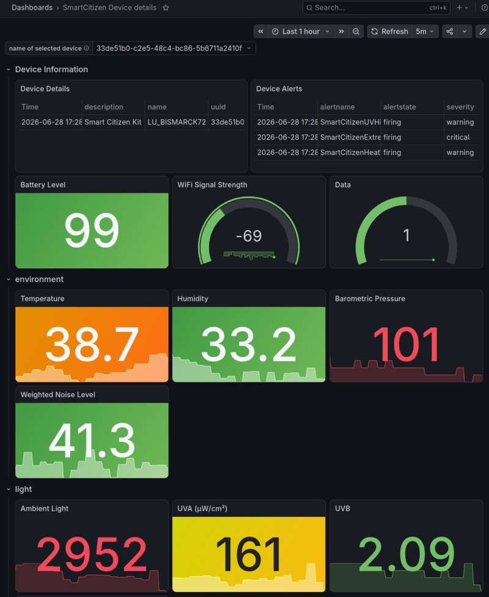

# SmartCitizen Prober

SmartCitizen Prober is a small service for checking the status of
SmartCitizen devices and report their connectivity and sensors' status.

It is split into four binaries based on use case:

1. smcdownloader: Download data from SmartCitizen devices and store it
   locally for further processing.

2. smcjob: Tool that could be scheduled periodically to check device status
   and send notifications if devices are down or not sending data.

3. smcprober: Prometheus exporter to expose device metrics for monitoring.
   It is designed to be deployed in Kubernetes using Helm and could be used
   for advanced monitoring and alerting.

4. gen-device-dashboard: Generates Grafana dashboard JSON from a config file,
   used to keep the dashboard definition in source control.

## Status

Project is in early development stage and developed as sideproject.
Features and APIs may change without notice.

## Features

- Prometheus exporter for SmartCitizen device sensors (temperature, humidity,
  air quality PM1/PM2.5/PM4/PM10, noise, UV, battery, WiFi)
- Prometheus alert rules for environment thresholds (temperature, humidity,
  UV index, noise level, PM2.5/PM10 air quality, Saharan dust detection)
- Sensor health alerts (data absent, stuck sensor detection)
- Grafana dashboard with per-device stat panels and background threshold
  coloring, generated from a JSON config via `gen-device-dashboard`
- Scheduled job (`smcjob`) with ntfy.sh push notifications

## Dashboard



## Getting Started

### Prerequisites

- [Go](https://golang.org/doc/install) (for local development; see `go.mod` for the required version)
- [mise](https://mise.jdx.dev) — manages all other CLI dependencies at pinned versions

With mise installed, run once in the repo root to get all tools:

```bash
mise trust && mise install
```

This installs: `task`, `helm`, `kubectl`, `golangci-lint`, and `promtool` at the versions pinned in `.mise.toml`.

For containerised builds you also need Docker or [nerdctl](https://github.com/containerd/nerdctl) — install whichever your system uses; the `DOCKER_BIN` variable in `Taskfile.yml` controls which one is called.

### Installation for Production

This section describes how to deploy `smcprober` in a Kubernetes cluster using Helm
and using pre-defined configuration files and prebuilt Docker images.

#### download configs

As configurations files are not included in the Helm chart package, you need to download them first:

```bash
mkdir tmp && cd tmp
curl -L -O https://raw.githubusercontent.com/timgluz/smcprober/refs/heads/main/configs/config-k8s.json
curl -L -O https://raw.githubusercontent.com/timgluz/smcprober/refs/heads/main/configs/config-exporter-k8s.json
curl -L -o env https://raw.githubusercontent.com/timgluz/smcprober/refs/heads/main/env.example
```

note: as soon as the application matures, configs will be templatized and included in the chart package.

#### update configs and env files

- update `config-k8s.json` and `config-exporter-k8s.json` if needed.

- update `env` file
  only `SMARTCITIZEN_USERNAME` & `SMARTCITIZEN_TOKEN` are required.
  The value of `SMARTCITIZEN_USERNAME` would be your email and
  `SMARTCITIZEN_TOKEN` is your API key that you access on your Smartcitizen's profile.

NTFY Webhooks urls are optional, they are used only for sending alerts.

#### installation

- deploy helm chart

```bash
helm install smcprober-smoke oci://registry-1.docker.io/tauho/smcprober \
  --namespace smcprober-smoke \
  --create-namespace \
  --set namespace=smcprober-smoke \
  --set-file=configJSON=config-k8s.json \
  --set-file=configExporterJSON=config-exporter-k8s.json \
  --set-file=secret.env=env
```

- list all resources in namespace

```bash
kubectl get all -n smcprober-smoke
```

### uninstall

```bash
helm uninstall smcprober-smoke
```

### Container Registry Configuration

The build, release and deploy tasks use **public Docker Hub by default**, so no
extra configuration is needed to get started. To use a private/internal
registry instead, set these variables in `.env` (or the environment):

| Variable | Default | Purpose |
| --- | --- | --- |
| `REGISTRY_HOST` | `docker.io` | Image registry host used to tag/push images |
| `OCI_REGISTRY_HOST` | `registry-1.docker.io` | Helm OCI host (differs from `docker.io` on Docker Hub) |
| `REGISTRY_NAMESPACE` | `tauho` | Docker Hub user/org, or registry project |
| `IMAGE_NAME` | `smcprober` | Image name |
| `REGISTRY_INSECURE` | `false` | Set `true` only for registries served over plain HTTP |
| `IMAGE_PULL_SECRET` | *(empty)* | `imagePullSecret` name passed to the Helm chart |

Credentials always come from `DOCKER_USERNAME` / `DOCKER_PASSWORD`.

For example, an internal Harbor served over plain HTTP:

```bash
REGISTRY_HOST="harbor.example.com"
OCI_REGISTRY_HOST="harbor.example.com"
REGISTRY_NAMESPACE="smcprober"
IMAGE_NAME="smcprober"
REGISTRY_INSECURE="true"
IMAGE_PULL_SECRET="smcprober-registry"
```

Then create the pull secret and deploy:

```bash
task deploy:credentials   # creates $IMAGE_PULL_SECRET in the target namespace
task release:docker       # tag + push the image
task release:helm         # package + push the chart
task deploy:helm          # deploy with the configured image repository
```

> **Note:** `REGISTRY_INSECURE=true` disables TLS verification (`--tls-verify=false`,
> `--plain-http`, `--insecure-registry`). Leave it `false` for any registry that
> serves TLS. For Kubernetes to pull from a plain-HTTP registry, the nodes must
> also list it as an insecure registry.

### Deploying the Helm Chart with a Custom Registry

The **chart** and the **container image** live in independent registries — you can
pull the chart from one and the image from another. Both are plain Helm values,
so no chart changes are required. The examples below use an internal Harbor at
`harbor.example.com`; substitute your own host and project.

#### Pull the chart from a custom OCI registry

```bash
# Add --plain-http if the registry is served over plain HTTP
helm registry login harbor.example.com -u "$DOCKER_USERNAME"

helm install smcprober oci://harbor.example.com/smcprober/smcprober \
  --namespace smcprober \
  --create-namespace \
  --set namespace=smcprober \
  --set-file=configJSON=config-k8s.json \
  --set-file=configExporterJSON=config-exporter-k8s.json \
  --set-file=secret.env=env
```

You can also install from a local checkout or a packaged chart, which is useful
when the chart itself is not published anywhere:

```bash
helm install smcprober ./helm \
  --namespace smcprober \
  --create-namespace \
  --set namespace=smcprober \
  --set-file=configJSON=config-k8s.json \
  --set-file=configExporterJSON=config-exporter-k8s.json \
  --set-file=secret.env=env
```

#### Create the image pull secret

Private registries require an `imagePullSecret` in the same namespace as the
release. Create the namespace first, then the secret:

```bash
kubectl create namespace smcprober --dry-run=client -o yaml | kubectl apply -f -

kubectl create secret docker-registry smcprober-registry \
  --namespace smcprober \
  --docker-server=harbor.example.com \
  --docker-username="$DOCKER_USERNAME" \
  --docker-password="$DOCKER_PASSWORD"
```

#### Point the chart at the custom image

Keep the settings in a values file so installs and upgrades stay consistent:

```yaml
# values-private-registry.yaml
namespace: smcprober
image:
  repository: harbor.example.com/smcprober/smcprober
  tag: "latest"
imagePullSecrets:
  - name: smcprober-registry
```

```bash
helm install smcprober oci://harbor.example.com/smcprober/smcprober \
  --namespace smcprober \
  --create-namespace \
  -f values-private-registry.yaml \
  --set-file=configJSON=config-k8s.json \
  --set-file=configExporterJSON=config-exporter-k8s.json \
  --set-file=secret.env=env
```

The same settings can be passed inline:

```bash
helm install smcprober ./helm \
  --namespace smcprober \
  --create-namespace \
  --set namespace=smcprober \
  --set image.repository=harbor.example.com/smcprober/smcprober \
  --set image.tag=latest \
  --set "imagePullSecrets[0].name=smcprober-registry" \
  --set-file=configJSON=config-k8s.json \
  --set-file=configExporterJSON=config-exporter-k8s.json \
  --set-file=secret.env=env
```

This also covers a **private Docker Hub** repository: set
`image.repository=tauho/smcprober` (or `docker.io/tauho/smcprober`) and create the
secret with `--docker-server=docker.io`.

#### Upgrade an existing release

```bash
helm upgrade smcprober oci://harbor.example.com/smcprober/smcprober \
  --namespace smcprober \
  -f values-private-registry.yaml \
  --set image.tag=<new-tag>
```

#### Verify the deployment

```bash
kubectl get pods -n smcprober
kubectl get deployment -n smcprober \
  -o jsonpath='{.items[*].spec.template.spec.containers[*].image}{"\n"}'
```

#### Simplifying with Taskfile variables

If you set the registry variables from [Container Registry Configuration](#container-registry-configuration)
in `.env`, the equivalent one-liners become:

```bash
task deploy:credentials   # create $IMAGE_PULL_SECRET in $SMC_NAMESPACE
task deploy:helm          # deploy with $IMAGE_REPO and $IMAGE_PULL_SECRET applied
```

`deploy:helm` automatically passes `image.repository=$IMAGE_REPO` and, when set,
`imagePullSecrets[0].name=$IMAGE_PULL_SECRET`.

### Installation for Development

1. Clone the repository:

```bash
git clone <repository-url>
cd smcprober
```

1. Install Go dependencies:

```bash
go mod download
```

### Configuration

1. Update environment variables in `.env` file:

```bash
cp .env.example .env
nano .env
```

1. Configure the application settings in `configs/config.json`:

### Running the Application

#### Run Locally

```bash
task run:exporter   # Prometheus exporter on port 8080
task run:job        # One-shot alert job
task run:downloader # Download device data from API
```

#### Run with Docker

```bash
task build:docker   # Build image via nerdctl
task run:docker     # Build and run container
```

### Development

Available Task commands:

- `task run:exporter` - Run Prometheus exporter locally (port 8080)
- `task run:job` - Run one-shot alert job
- `task run:downloader` - Download device data from API
- `task build:docker` - Build Docker image via nerdctl
- `task run:docker` - Build and run Docker container
- `task lint:go` - Run golangci-lint
- `task lint:go:fix` - Run golangci-lint with auto-fix
- `task lint:all` - Run all linters (Go, Helm, Markdown)
- `task test:alerts` - Run Prometheus alert rule tests
- `task generate:dashboards` - Regenerate Grafana dashboard JSON
- `task template:helm` - Template and validate Helm chart
- `task release:docker` - Build and push the image tagged with the VERSION file value
- `task release:helm` - Package and push Helm chart
- `task release:tag` - Tag and push the VERSION file value to trigger a release
- `task release:version` - Print the current version
- `task release` - Release both Docker and Helm
- `task deploy:credentials` - Deploy credentials to Kubernetes
- `task deploy:ci:credentials` - Deploy Docker credentials for CI pipeline (smc-cicd namespace)

View all available tasks:

```bash
task --list
```

#### Alert rule tests

```bash
task test:alerts
```

#### Grafana dashboard

The dashboard JSON committed to `helm/dashboards/` is generated from
`configs/device-dashboard.json`. After editing the config, regenerate:

```bash
task generate:dashboards
```

### Deployment

#### Kubernetes with Helm

1. Create the namespace:

```bash
kubectl create namespace smcprober
```

1. Deploy credentials (requires `DOCKER_USERNAME` and `DOCKER_PASSWORD`
   environment variables):

```bash
DOCKER_USERNAME=your-username DOCKER_PASSWORD=your-password task deploy:credentials
```

Note: The `deploy:credentials` task also creates the namespace if it
doesn't exist.

1. Template and preview the Helm deployment:

```bash
task template:helm
```

1. Deploy generated Helm chart to cluster:

```bash
k apply -f smcprober.yaml
```

#### Prometheus Monitoring

The Helm chart includes optional ServiceMonitor support for automatic metrics
discovery by Prometheus Operator.

**Prerequisites:**

- [Prometheus Operator](https://github.com/prometheus-operator/prometheus-operator)
  installed in your cluster

**Enable ServiceMonitor:**

```bash
helm install smcprober ./helm \
  --set "imagePullSecrets[0].name"="smcprober-registry" \
  --set-file=config=configs/config-k8s.json \
  --set-file=secret.env=.env \
  --set serviceMonitor.enabled=true
```

**Configure ServiceMonitor:**

You can customize the ServiceMonitor settings in your `values.yaml`:

```yaml
serviceMonitor:
  enabled: true
  interval: 30s # Scrape interval
  scrapeTimeout: 10s # Scrape timeout
  path: /metrics # Metrics endpoint path
  honorLabels: true # Honor labels from scraped metrics
  labels: {} # Additional labels for ServiceMonitor
  annotations: {} # Additional annotations
```

The application exposes Prometheus metrics at `/metrics` endpoint on port 8080.

## CI/CD

Multi-arch Docker images are built via a Tekton pipeline defined in
`helm/pipelines/build-multiarch-image.yaml`. It runs a credential pre-check,
resolves the version from the `VERSION` file, runs parallel `linux/amd64` and
`linux/arm64` builds, and finally merges them into a single manifest.

Pipeline task order:

```
verify-creds ── resolve-version
                     ├── build-amd64 (parallel)
                     └── build-arm64 (parallel)
                             └── create-manifest
                                     └── release-helm (tagged releases only)
```

### Versioning

`VERSION` (for example `v0.0.2`) is the source of truth for the current release.
Git tags and the file keep the `v` prefix; **published artifacts drop it** and use
bare SemVer (`0.0.2`), because Helm rejects a `v` prefix in a chart version. That
bare version is the image tag, the chart `version` and the chart `appVersion`, and
the pipeline fails if the release tag or `helm/Chart.yaml` do not match `VERSION`,
so a version can never be published under the wrong tag.

| Event | Published image tags |
| --- | --- |
| Push to `main` | `latest` |
| Push tag `vX.Y.Z` | `X.Y.Z` (immutable) and `latest` |

Tagged releases also publish the Helm chart as `smcprober-X.Y.Z`, so each release
gets a unique chart version instead of overwriting the previous one.

### Prerequisites

- [Tekton Pipelines](https://tekton.dev/docs/installation/pipelines/) installed in your cluster
- [tkn CLI](https://tekton.dev/docs/cli/) installed locally
- The `verify-dockerhub-creds`, `resolve-version`, `git-clone-and-build`,
  `create-docker-manifest`, and `package-helm` Tasks deployed to the `smc-cicd` namespace
- A Kubernetes Secret named `docker-config` containing registry credentials in the
  `smc-cicd` namespace (Docker Hub by default)

### Deploy the pipeline

```bash
kubectl create namespace smc-cicd --dry-run=client -o yaml | kubectl apply -f -
kubectl apply -f helm/tasks/verify-dockerhub-creds.yaml
kubectl apply -f helm/tasks/resolve-version.yaml
kubectl apply -f helm/tasks/git-clone-and-build.yaml
kubectl apply -f helm/tasks/create-docker-manifest.yaml
kubectl apply -f helm/tasks/release-helm.yaml
kubectl apply -f helm/pipelines/build-multiarch-image.yaml
```

Create the registry credentials secret (requires `DOCKER_USERNAME` and `DOCKER_PASSWORD` in `.env`;
`--docker-server` defaults to `REGISTRY_HOST`):

```bash
task deploy:ci:credentials
```

Verify registration:

```bash
tkn pipeline list -n smc-cicd
```

### Trigger a build

`image` is the repository **without** a tag; the pipeline appends the resolved
version. Leave `release-tag` empty for a `latest` build:

```bash
tkn pipeline start build-multiarch-image \
  --namespace smc-cicd \
  --param repo=timgluz/smcprober \
  --param revision=main \
  --param image=docker.io/tauho/smcprober \
  --param registry=docker.io \
  --workspace name=dockerconfig,secret=<docker-credentials-secret> \
  --showlog
```

Replace `<docker-credentials-secret>` with the name of your Secret. When pushing
to a custom registry, set `--param image` and `--param registry` to that
registry's host, and add `--param registry-insecure=true` only if it is served
over plain HTTP.

### Release a fixed version

Bump `VERSION` (for example to `v0.0.3`), set `0.0.3` as `version` and `appVersion`
in `helm/Chart.yaml`, add a `CHANGELOG.md` entry, merge to `main`, then tag:

```bash
task release:tag          # tags with the VERSION file value and pushes it
```

Or by hand:

```bash
git tag -a v0.0.3 -m "Release v0.0.3"
git push origin v0.0.3
```

The tag push publishes `docker.io/tauho/smcprober:0.0.3`, moves `latest`, and
publishes the Helm chart as `smcprober-0.0.3`. Deployments can then pin the fixed
version (`task release:version` prints both forms):

```bash
helm upgrade --install smcprober ./helm -n smcprober \
  --set image.repository=docker.io/tauho/smcprober \
  --set image.tag=0.0.3
```

To publish a release manually instead of via a tag push, pass the tag in
`release-tag` (it must match `VERSION`) and optionally move `latest`:

```bash
tkn pipeline start build-multiarch-image \
  --namespace smc-cicd \
  --param repo=timgluz/smcprober \
  --param revision=v0.0.3 \
  --param image=docker.io/tauho/smcprober \
  --param release-tag=v0.0.3 \
  --param additional-tag=latest \
  --workspace name=dockerconfig,secret=<docker-credentials-secret> \
  --showlog
```

### Monitor runs

```bash
# List all runs
tkn pipelinerun list -n smc-cicd

# Stream logs of the latest run
tkn pipelinerun logs --last -n smc-cicd -f

# Re-run a previous run
tkn pipelinerun rerun <run-name> -n smc-cicd
```

### GitHub webhook (automatic builds on push)

Builds can be triggered automatically on every push to `main` via a GitHub webhook
and Tekton Triggers. The EventListener is exposed publicly over Tailscale Funnel.

#### Deploy the EventListener

```bash
task deploy:triggers
```

#### Create the webhook secret

Generate a random token and store it in the cluster:

```bash
GITHUB_WEBHOOK_SECRET=$(openssl rand -hex 32)
echo "Save this token — you will need it in GitHub: $GITHUB_WEBHOOK_SECRET"
GITHUB_WEBHOOK_SECRET=$GITHUB_WEBHOOK_SECRET task deploy:webhook:secret
```

#### Get the public webhook URL

```bash
task get:webhook:url
```

#### Configure the webhook in GitHub

Go to the repository **Settings → Webhooks → Add webhook** and fill in:

| Field | Value |
|-------|-------|
| Payload URL | output of `task get:webhook:url` |
| Content type | `application/json` |
| Secret | the token from the step above |
| Events | `Just the push event` |

Only pushes to `main` and `v*` tag pushes trigger builds; other branches are
filtered by the EventListener. Tag pushes publish the fixed version from
`VERSION`, while `main` pushes publish `latest`.
